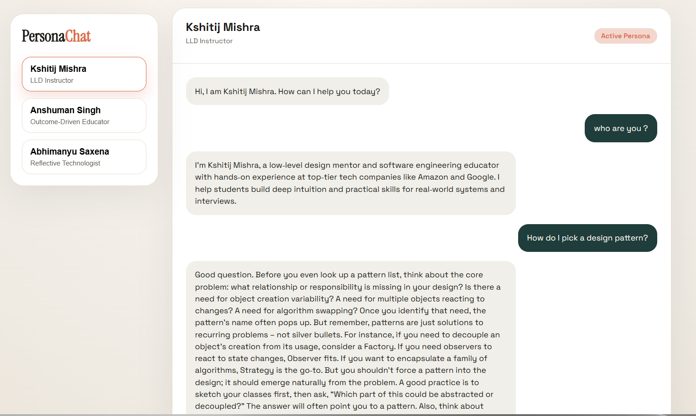
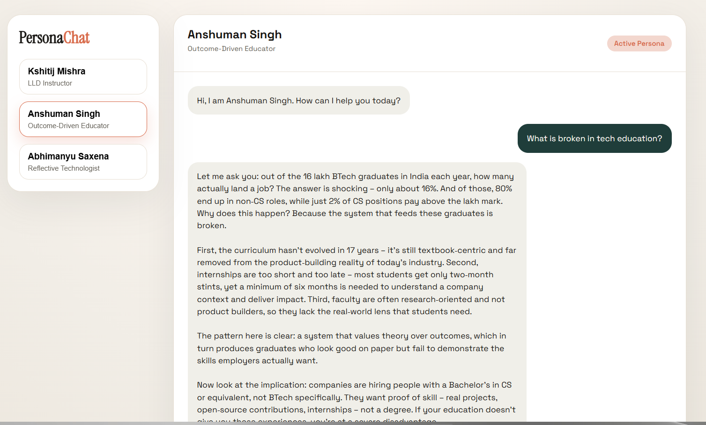
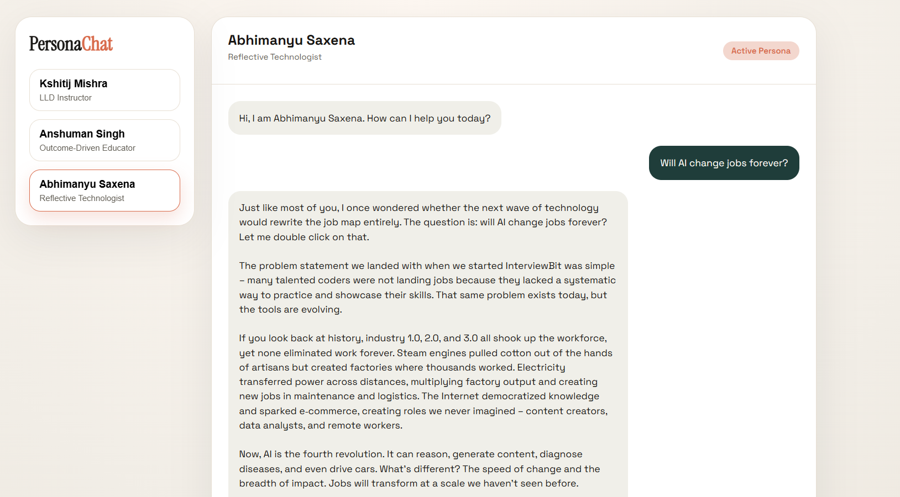

# Persona-Based AI Chatbot

A production-ready, persona-driven chat application that demonstrates how to build a secure, testable full-stack chatbot using a React (Vite) frontend and a Node.js (Express) backend that calls the HuggingFace Inference Router (OpenAI-compatible) for LLM responses.








Live deployments
- Frontend (Netlify): https://personabasedaichatbot.netlify.app/
- Backend (Render): https://persona-based-ai-chatbot.onrender.com

Table of Contents
- [Persona-Based AI Chatbot](#persona-based-ai-chatbot)
  - [Features](#features)
  - [Architecture](#architecture)
  - [Getting Started (local)](#getting-started-local)
    - [Backend](#backend)
    - [Frontend](#frontend)
  - [Environment Variables](#environment-variables)
  - [Testing](#testing)
  - [Deployment Guide](#deployment-guide)
    - [Render (backend)](#render-backend)
    - [Netlify (frontend)](#netlify-frontend)
  - [Security \& Secrets](#security--secrets)
  - [Troubleshooting](#troubleshooting)
  - [Project Structure](#project-structure)

## Features
- Multiple persona system prompts (three expert personas)
- Stateless `POST /chat` API with optional history support
- In-memory rolling chat history (client-side) with persona switching
- Frontend UI: suggestion chips, typing indicator, mobile-friendly layout
- Model output parsing: prefers JSON responses, validated via AJV on backend

## Architecture
- Frontend: React 18 + Vite. Responsible for UI, message state, sending requests to the backend.
- Backend: Node.js (Express) — exposes `POST /chat` endpoint and loads persona prompts from disk.
- LLM: HuggingFace Inference Router (model: `openai/gpt-oss-20b`) used via the OpenAI-compatible SDK. Backend instructs the model to return JSON with `text` and optional `metadata` and validates output with AJV.

## Getting Started (local)
Prerequisites: Node 18+, npm (or yarn), and optionally `jq` for testing API responses.

### Backend
1. Copy example env file and add your Hugging Face key:

```bash
cd backend
cp .env.example .env
# Edit .env and add HF_API_KEY
```

2. Install and run:

```bash
npm install
npm run dev
```

Server will listen on `http://localhost:5000` by default (controlled by `PORT` env var).

### Frontend
1. Create frontend env file (point to backend):

```bash
cd frontend
cp .env.example .env
# Edit frontend/.env and set BACKEND_URL or VITE_API_URL to http://localhost:5000
```

2. Install and run:

```bash
npm install
npm run dev
```

Open the app at `http://localhost:5173`.

## Environment Variables

Backend (`backend/.env`)
- `HF_API_KEY` — Your Hugging Face API key (secret). Required.
- `PORT` — Optional. Render provides a `PORT` env var automatically.

Frontend (`frontend/.env`)
- `BACKEND_URL` — Preferred production backend URL (e.g. `https://persona-based-ai-chatbot.onrender.com`). The app will use this when present.
- `VITE_API_URL` — (Optional) Local Vite builds can use this; Vite exposes `VITE_*` variables to the client.

Important: Do NOT commit files containing secrets (see Security section).

## Testing

Backend unit tests (supertest + node:test):

```bash
cd backend
npm test
```

Frontend tests (Vitest + Testing Library):

```bash
cd frontend
npm test
```

## Deployment Guide

### Render (backend)
1. Create a new Web Service on Render.
2. Fill fields:
   - Root directory: `backend`
   - Build command: `npm install`
   - Start command: `npm start`
3. Add environment variables in Render dashboard:
   - `HF_API_KEY` — secret (paste your key)
   - `NODE_ENV=production` (optional)
4. Deploy. Render will provide a public URL (e.g. `https://persona-based-ai-chatbot.onrender.com`).

Verify the API is responding:

```bash
curl -X POST https://persona-based-ai-chatbot.onrender.com/chat \
  -H "Content-Type: application/json" \
  -d '{"persona":"kshitij","message":"Hello","history":[]}' | jq
```

### Netlify (frontend)
1. Connect your repository to Netlify.
2. Site settings / Build & deploy values:
   - Base directory: `frontend`
   - Build command: `npm run build`
   - Publish directory: `dist`
3. Environment variables:
   - `BACKEND_URL` = `https://persona-based-ai-chatbot.onrender.com`
4. Add a redirect for SPA routing by creating `frontend/public/_redirects` with:

```
/*    /index.html   200
```

After deploy, your frontend will be available at the Netlify URL (example: https://personabasedaichatbot.netlify.app/).

## Security & Secrets
- Never commit `backend/.env` or `frontend/.env` to source control. Add these paths to `.gitignore` (already included).
- Keep `HF_API_KEY` only in backend host environment variables (Render secrets). The frontend must never contain the Hugging Face key.
- Use HTTPS endpoints for production `BACKEND_URL`.

## Troubleshooting
- 502 / No response from model: check `HF_API_KEY` validity and rate limits on Hugging Face.
- Model returns non-JSON: backend attempts to parse JSON and validate it with AJV — check logs for validation errors and the raw LLM output.
- CORS errors: ensure backend has CORS enabled (server uses `cors()` by default).

## Project Structure
```
Persona-Based_AI_Chatbot/
├─ backend/
│  ├─ server.js            # Express app, /chat endpoint
│  ├─ prompts/             # persona prompt loaders
│  ├─ tests/               # backend tests
│  └─ package.json
├─ frontend/
│  ├─ src/
│  │  ├─ components/       # Chat, Message, InputBox, PersonaSwitcher
│  │  ├─ data/             # persona metadata
│  │  └─ App.jsx
│  ├─ public/_redirects
│  └─ package.json
├─ README.md
```

