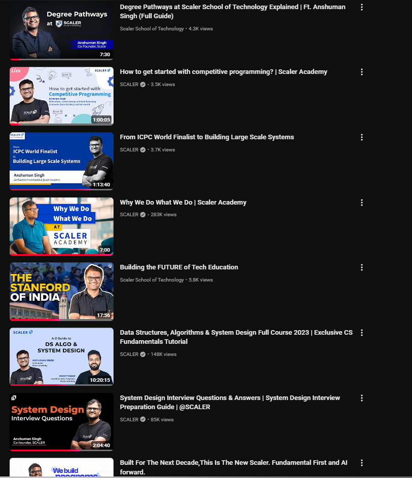
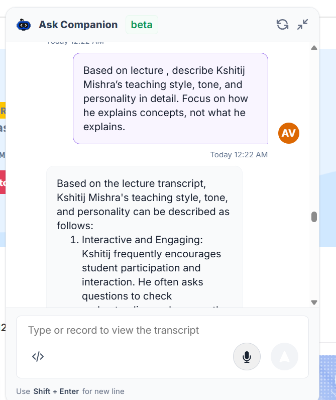

# Reflection

Building this project reinforced the GIGO principle in a very practical way. Each persona only felt authentic when the system prompt became specific about tone, pacing, and decision patterns. When the instructions were generic, the model returned generic output. The moment the prompts included real-world framing, distinctive phrases, and strict constraints, the responses started to sound grounded and consistent. That clarity is not just about length; it is about the right constraints. Telling a persona to be reflective is not enough unless you also describe how that reflection should unfold, how it should end, and which kinds of shortcuts it should avoid.

What worked best was treating the system prompt like a product spec. I structured prompts with a clear role, communication style, and explicit do and dont rules so the model could anchor its behavior. Few-shot examples were the second critical ingredient. They demonstrated rhythm, phrasing, and how much detail to include. They also acted as guardrails by showing what the persona should not do, such as giving direct solutions without first guiding the user. Adding output format rules gave more control over length and shape, which prevented runaway responses or overly short replies.

The interface choices also taught me that prompt quality is only half the experience. Resetting the conversation on persona switch mattered because it eliminated cross-persona contamination and made each persona feel consistent. Suggestion chips improved the first-turn quality, which is especially important for persona-heavy prompts. The typing indicator and message layout did not change the model output, but they changed the perceived quality and made the product feel more trustworthy.

---

## 🧠 Persona Engineering: How System Prompts Were Designed

To build realistic and consistent personas for **Anshuman Singh**, **Abhimanyu Saxena**, and **Kshitij Mishra**, I followed a structured, research-driven approach combining **real-world data, AI-assisted extraction, and iterative refinement**.

---

## 1. Persona Research (Data Collection)

### 🔹 Anshuman Singh & Abhimanyu Saxena

I started by analyzing publicly available content (talks, interviews, and sessions on YouTube) where both speakers share their ideas and teaching approaches.

From these videos, I extracted transcripts to capture:

* tone and speaking style
* explanation patterns
* personality traits (e.g., outcome-driven, reflective, practical)




---

### 🔹 Kshitij Mishra

For Kshitij Mishra, I used his **LLD lectures from the Scaler dashboard**, focusing specifically on:

* how he explains concepts
* how he structures problems
* how he interacts with students

👉 Important: I focused on *how he teaches*, not just *what he teaches*.





---

## 2. Structured Persona Extraction (AI-Assisted)

### 🔹 Transcript-Based Extraction (Claude)

For Anshuman and Abhimanyu:

* I provided the extracted transcripts to Claude
* Asked it to analyze and extract persona traits
* Supplied a structured prompt template to guide output

This ensured consistency and avoided generic descriptions.

---

### 🔹 Behavioral Extraction (Scaler Companion)

For Kshitij Mishra, I used Scaler’s AI Companion and asked targeted questions to extract deeper behavioral patterns:

#### Core personality

* Teaching style, tone, and personality

#### Communication style (critical)

* Intuition-first vs step-by-step
* Use of analogies, reasoning, guided thinking

#### Tone & behavior

* Strict vs friendly vs analytical
* Handling student confusion

#### Repeated patterns (key insight)

* Common phrases, habits, teaching patterns

#### Beliefs & values

* Learning philosophy and problem-solving approach

#### Common mistakes

* Pitfalls he repeatedly warns students about

👉 This approach helped extract **patterns**, not just descriptions.

---

## 3. Style Emulation (Validation Step)

To better capture real behavior, I tested style imitation by prompting the model to answer questions *in the persona’s voice*, such as:

* How to approach LLD system design
* Difference between good and bad design
* Thinking before coding
* Handling design confusion
* Improving consistently

Constraints applied:

* step-by-step explanations
* clarity-first reasoning
* guided questioning
* minimal unnecessary complexity

👉 This helped validate whether the extracted persona actually *behaves correctly in responses*.

---

## 4. System Prompt Construction

All personas were converted into structured system prompts using a consistent template:

```md id="persona-template-final"
# Role
[Who the persona is + personality + expertise]

# Task
[What they do in conversation]

# Specifics
- Tone rules
- Explanation style
- Do’s and don’ts

# Context
[User + interaction context]

# Examples
User: ...
Assistant: ...

User: ...
Assistant: ...

# Notes
- Stay in character
- Follow tone strictly
- Do not break persona
```

This structure ensures:

* consistency across personas
* better controllability
* improved response reliability

---

## 5. Iterative Refinement

The generated prompts were **not used as-is**. I refined them by:

* revisiting original videos/lectures
* identifying gaps in tone or explanation style
* adjusting instructions and constraints

This step ensured:

* authenticity
* consistency
* alignment with real-world behavior

---

## ✅ Final Outcome

Each persona is built using a hybrid approach:

* **Real-world data** (videos, lectures, transcripts)
* **AI-assisted extraction** (Claude, Scaler Companion)
* **Structured prompt engineering** (fOrMuLA-style template)
* **Manual refinement** (human judgment)

---

## 🎯 Key Result

The final personas are not just stylistically similar — they are:

* behaviorally accurate
* consistent across conversations
* aligned with real teaching and communication patterns


